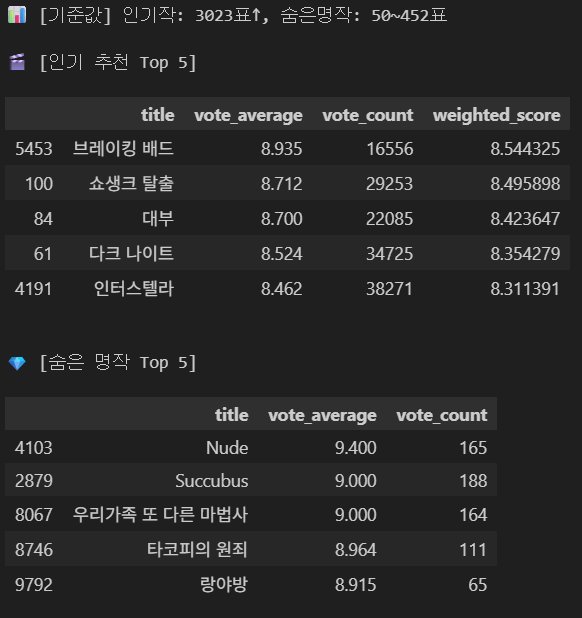

# 🎬 OTT 시장의 숨은 명작 찾기 (TMDB Data Analysis)

> **"너무 많은데 볼 게 없다?"**
> 넘쳐나는 콘텐츠 속에서 '선택의 역설'을 해결하고, 대중성은 낮지만 작품성이 뛰어난 **'숨은 명작(Hidden Gems)'** 을 발굴하는 데이터 분석 프로젝트입니다.

## 👥 Team: SKN22-EDA-4Team
| 이름 | 역할 |
| --- | --- |
| **장완식** | 데이터 전처리, 가중 평점 알고리즘 구현, 시각화 및 리포트 작성 |
| **최민호** | 데이터 수집 및 병합, 베이스라인 코드 작성 |
| **이도훈** | EDA 수행, 이상치 탐지 및 상관관계 분석 |
| **박준석** | 최종 데이터 검증 및 발표 자료 구성 |
| **문승준** | 데이터 분석 및 프로젝트 참여 |

---

## 1. 📌 분석 배경
* **선택의 역설 (Paradox of Choice):** 스트리밍 시장은 콘텐츠 포화 상태이지만, 사용자는 오히려 무엇을 봐야 할지 결정하기 힘든 피로감을 느낍니다.
* **장르 쏠림 현상:** 플랫폼 메인은 대중적인 드라마나 예능 위주로 편성되어 있어, 훌륭한 작품성을 가진 비주류 콘텐츠는 묻히기 쉬운 구조입니다.
* **목표:** 단순 인기작 나열이 아닌, **데이터 기반의 새로운 가치(숨은 명작)** 를 제안하여 사용자에게 발견의 즐거움을 제공합니다.

## 2. 📊 데이터 개요 및 전처리
* **데이터 출처:** [TMDB (The Movie Database) API](https://www.themoviedb.org/)
* **데이터 규모:** 인기 영화 및 TV 프로그램 데이터 약 10,000건
* **대상 플랫폼:** Netflix, Watcha, Disney+, Wavve, Amazon Prime Video 등
* **전처리 (Preprocessing):**
    * `Netflix Standard with Ads`와 `Netflix` 데이터를 단일 **'Netflix'** 로 통합
    * 장르 및 제공사 정보 결측치 AI 검색 및 크로스 체크로 보완

---

## 3. 💡 분석 방법론: 가중 평점 (Weighted Rating)
단순 평점 순으로 나열 시 소수의 투표만으로 10점을 받는 왜곡을 방지하기 위해 **IMDb의 가중 평점 공식** 을 도입하여 두 가지 전략 그룹으로 나누었습니다.

$$W = \frac{v}{v+m} \cdot R + \frac{m}{v+m} \cdot C$$
*(v: 투표수, m: 최소 투표수, R: 평점, C: 전체 평균)*

### 🅰️ Group 1: 인기 추천작 (Popular)
* **정의:** 대중적으로 검증된 실패 없는 선택 (레드 오션)
* **기준:** 투표수 상위 10% 이상 (약 3,000표 이상)
* **정렬:** **가중 평점(Weighted Rating)** 순

### 🅱️ Group 2: 숨은 명작 (Hidden Gems)
* **정의:** 인지도는 낮지만 작품성은 뛰어난 발견의 영역 (블루 오션)
* **기준:** 투표수 50표 이상 ~ 상위 10% 미만 & 평점 7.0 이상
* **정렬:** 가중치를 제외한 **순수 평점(Vote Average)** 순 (투표수가 적어 불리해지는 것을 방지)

---

## 4. 📈 시각화 및 분석 결과

### 4.1. 시장 현황: 장르 불균형
드라마, 코미디 장르가 압도적으로 많은 비중을 차지하며, 다큐멘터리나 역사 등의 장르는 공급이 매우 부족한 '장르 쏠림' 현상이 확인되었습니다.

### 4.2. 그룹별 특성 비교 (인기작 vs 숨은 명작)
**숨은 명작(Hidden Gems)** 그룹은 투표수(대중성)는 현저히 낮지만, **평점(작품성)은 인기작과 대등하거나 오히려 더 높은 분포**를 보입니다.

### 4.3. 전략 포지셔닝 맵 (Blue Ocean Strategy)
* **우측(Red):** 이미 경쟁이 치열한 인기작 시장
* **좌측(Blue):** 우리가 타겟팅한 **'숨은 명작'** 시장 (High Rating, Low Votes)

### 4.4. OTT 플랫폼별 장르 특화도
플랫폼별로 강점을 보이는 장르가 뚜렷하게 구분됩니다.
* **Watcha/Crunchyroll:** 애니메이션 특화
* **Disney+:** 가족/판타지 강세
* **Netflix:** 전 장르 고루 분포

### 4.5. 추천 그룹별 OTT 보유 비중
넷플릭스는 '인기작' 보유율이 높지만, **'숨은 명작'을 찾기 위해서는 Watcha와 Wavve가 더 유리**하다는 결과가 도출되었습니다.

### 4.6. 콘텐츠 유형 비교 (Movie vs TV)
인기작은 TV 시리즈 비중이 높지만, **숨은 명작은 70% 이상이 영화(Movie)** 로 구성되어 있습니다. 짧은 호흡으로 새로운 작품을 도전하고 싶은 사용자에게 적합합니다.

---

## 5. 📝 결론 (Conclusion)
1.  **데이터의 발견:** 유명하지 않아도 높은 평점을 유지하는 '숨은 명작'들이 다수 존재함을 데이터로 입증했습니다.
2.  **플랫폼 전략:** 넷플릭스만으로는 다양한 명작을 즐기기에 한계가 있으며, **Watcha, Wavve 등 대안 플랫폼의 활용**이 필요합니다.
3.  **사용자 제안:** 긴 호흡의 드라마가 부담스러운 사용자에게, 검증된 작품성의 **'숨은 명작 영화'** 를 추천하는 것이 효과적입니다.

---

## 📜 License

This project is licensed under the MIT License - see the [LICENSE](LICENSE) file for details.
